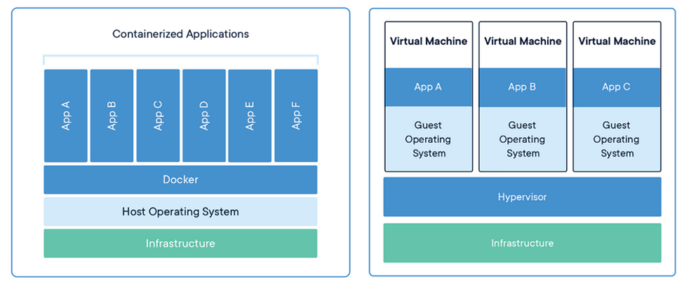

# DOCKER OVERVIEW
 

* What is a container?

A container is a standard unit of software that packages up code and all its dependencies, so the application runs quickly and reliably from one computing environment to another. allow a developer to package up an application with all the parts it needs, such as libraries and other dependencies, and deploy it as one package.

* What is Docker?

Docker is a tool designed to make it easier to create, deploy, and run applications by using containers. It is a PLATFORM that allows you to package and create containers. Docker enables you to separate your applications from your infrastructure so you can deliver software quickly.

* Why do you need Docker?

Before Docker, developers faced challenges such as dependency management, environment consistency, isolation conflicts, manual infrastructure management, deployment complexity, scalability/portability issues, and reproducibility problems. Docker addressed these by providing a platform for developing, shipping, and running applications in containers, which encapsulate applications and dependencies for consistent deployment across different environments.   Thanks to the container and Docker, the developer can rest assured that the application, the services, will run on any other different OS machine regardless of any customized settings that machine might have that could differ from the machine used for writing and testing the code.

* Docker Containers vs Virtual Machines

 

* Docker Architecture 
 

Docker Daemon:

Docker daemon is the brain behind the whole operation. When you use docker run command to start up a container, your docker client will translate that command into http API call, sends it to docker daemon, Docker daemon then evaluates the request, talks to underlying OS and provisions your container.

Docker Client:

The Docker client is used by users which interact with Docker. When you use commands such as docker run, the client sends these commands to Docker Daemon, which takes care of that. The Docker command uses the Docker API. The Docker client can communicate with more than one daemon.

Docker Desktop:

Docker Desktop is an easy-to-install application for your Mac or Windows environment that enables you to build and share containerized applications and microservices. Docker Desktop includes the Docker daemon, the Docker client, Docker Compose, Kubernetes.

Docker Registries:

A Docker registries stores Docker images. Docker Hub is a public registry that anyone can use, and Docker is configured to look for images on Docker Hub by default. If you want to create your own directory, then that is also possible. When you use the docker pull or docker run commands, the required images are pulled from your configured registry. When you use the docker push command, your image is pushed to your configured registry.

Docker Objects:

When you use Docker, you are creating and using images, containers, networks, volumes, plugins, and other objects. This section is a brief overview of some of those objects.

Images:

A Docker image is a read-only template that contains a set of instructions for creating a container that can run on the Docker platform. It provides a convenient way to package up applications and preconfigured server environments, which you can use for your own private use or share publicly with other Docker users.

Dockerfile:

A Dockerfile is a text file that contains a set of instructions used to build a Docker image. It defines the environment and configuration of a Docker container. With a Dockerfile, you can automate the process of creating Docker images, making it easier to share and deploy applications consistently across different environments.

 
Docker installation is dependent on the OS. Follow the instructions on the official page.
https://docs.docker.com/engine/install/

Docker Commands:

docker info/ docker: to check if docker is installed.

docker ps: This command lists all running Docker containers.docker ps -a lists all containers, including those that are not running.

Example: docker ps lists all running containers.

docker stop <container_id> or docker stop <container_name>:
 This command stops a running container.You can use either the container's ID or name to identify it.

Example: docker stop my_container stops a container named "my_container".

docker rm <container_id> or docker rm <container_name>: This command removes a container.You must stop the container before removing it.

Example: docker rm my_container removes a container named "my_container".

docker images:This command lists all Docker images stored locally on your system.

Example: docker images lists all available images.

docker rmi <image_id> or docker rmi <image_name>: This command removes a Docker image.You can specify the image either by its ID or name.

Example: docker rmi ubuntu removes the Ubuntu image.

docker pull <image_name>: This command pulls an image from a registry without running it.It's useful when you want to fetch an image without immediately using it.

Example: docker pull nginx pulls the Nginx image without running it.

docker exec -it <container_id> <command>: This command allows you to execute a command inside a running container.-it flags allocate an interactive terminal.

Example: docker exec -it my_container bash opens a bash shell inside a container named "my_container".

docker build <path_to_Dockerfile>: This command builds a Docker image from a Dockerfile located at the specified path.It's used to create custom Docker images.

Example: docker build. builds an image from a Dockerfile located in the current directory
